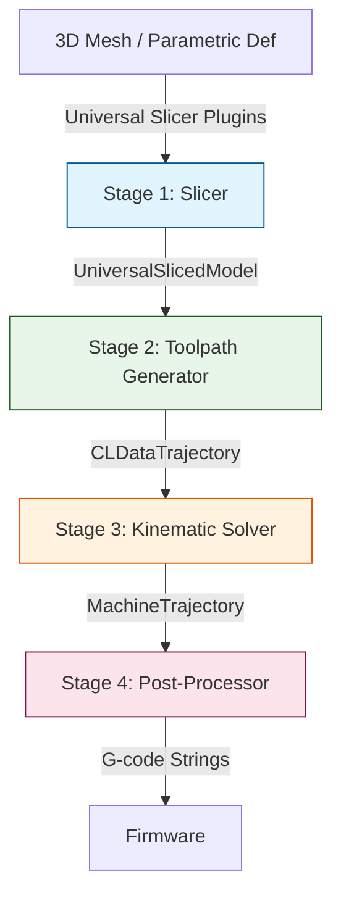

# Modular 5-Axis Additive Manufacturing CAM Architecture

## System Pipeline Diagram

## Data Contracts Registry
All inter-stage data exchanges are strongly typed using Pydantic in `src/common/schemas.py` and serialize to JSON files for standalone execution.

| Contract Schema | Origin -> Destination | Key Fields |
| --- | --- | --- |
| `UniversalSlicedModel` | Stage 1 -> Stage 2 | `layers` (List of `UniversalLayer`), each containing `contours` with `points` (X,Y,Z) and `normals` (I,J,K). |
| `MinimalPrintProfile` | Config -> Stage 2/4 | `layer_height`, `nozzle_diameter`, `continuous_spiral`, `filament_diameter`. |
| `CLDataTrajectory` | Stage 2 -> Stage 3 | `waypoints` (List of `CLDataWaypoint`): `x`, `y`, `z`, `i`, `j`, `k`, `extrusion_volume`, `feedrate`, `is_travel_move`. |
| `MachineConfig` | Config -> Stage 3 | `kinematic_topology`, pivot offsets, axis limits, `max_3axis_tilt_deg`. |
| `MachineTrajectory` | Stage 3 -> Stage 4 | `states` (List of `MachineStateVector`): `x`, `y`, `z`, `b`, `c`, `extrusion_volume`, `feedrate`. |

## Stage 1 Mathematical Slicing Strategies (`src/stage1_slicer/math_strategies.py`)

*Note: All strategies support adaptive local layer thickness and dynamic mesh bounds.*

| Strategy ID | Description | Parameters |
| --- | --- | --- |
| `planar` | Standard planar slicing ($Z = const$) | `start_z`, `end_z`, `layer_height` |
| `progressive_tilt` | Linearly tilts normal around X axis across layers. | `start_tilt_deg`, `end_tilt_deg` |
| `conical` | Deform-Slice-Undeform for support-free overhangs ($z' = z + r \cdot \tan\alpha$) | `cone_angle_deg` |
| `custom_expr` | Deform-Slice-Undeform using safe Python eval of $f(x, y)$ | `expression` |
| `external_field` | Point cloud spatial interpolation (pure Numpy IDW) | `vertex_deformations` array |

## Stage 3 Kinematic Solvers (`src/stage3_kinematics/registry.py`)

| Topology ID | Transformation |
| --- | --- |
| `trunnion_table_xyzbc` | $P_m = P_p + R_B(B) \cdot (R_C(C) \cdot P_e - P_p)$ |
| `swivel_head_xyzbc` | $P_m = P + P_p - R_C(C) \cdot R_B(B) \cdot P_p$ |
| `planar_3axis_xyz` | $P_m = P$ (Pass-through). Logs warnings if surface tilt exceeds `max_3axis_tilt_deg`. |

## User Interfaces

| Interface | Command | Description |
| --- | --- | --- |
| **Interactive GUI** | `streamlit run src/ui_app.py` | Web-based interface to generate/upload meshes, configure slicing/kinematics parameters, preview 3D layers/toolpaths via Plotly, and download G-code. |
| **CLI Runner** | `python3 src/pipeline_cli.py run-all` | Headless execution of all stages sequentially using JSON configs. |

## Validation & Test Matrix
Execute with `pytest tests/`

| File | Subsystem | Validation |
| --- | --- | --- |
| `test_stage1_math_slicer.py` | Stage 1 Plugin | Validates discrete plugin parameter parsing & default vertical normals. |
| `test_stage1_field_slicer.py` | Stage 1 Engine | Evaluates output structure of mathematical fields. |
| `test_mathematical_validation.py` | Stage 1 & 3 | **Mathematical Exactness**: Validates numerical derivatives against analytical expressions. Validates Kinematic FK/IK Roundtrip error $< 1e-5$. |
| `test_multi_kinematics.py` | Stage 3 Solvers | Tests topology configurations. |
| `test_stage4_postproc.py` | Stage 4 Post-proc | Validates volumetric to linear E conversion. |
| `test_visual_cases.py` | E2E CLI | Asserts all JSON and HTML files are generated correctly. |
